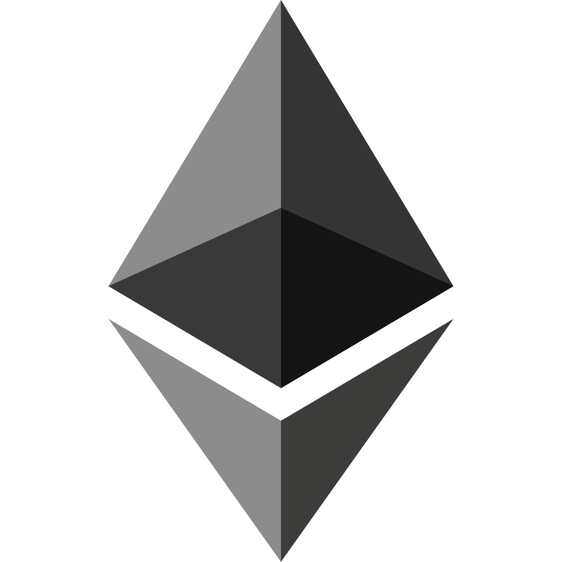
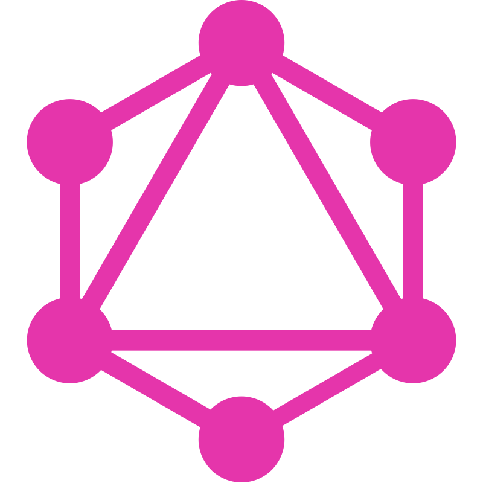

<!--
**ignazio-bovo/ignazio-bovo** is a ✨ _special_ ✨ repository because its `README.md` (this file) appears on your GitHub profile.

Here are some ideas to get you started:

- 🔭 I’m currently working on ...
- 🌱 I’m currently learning ...
- 👯 I’m looking to collaborate on ...
- 🤔 I’m looking for help with ...
- 💬 Ask me about ...
- 📫 How to reach me: ...
- 😄 Pronouns: ...
- ⚡ Fun fact: ...
-->

<!-- 
<pre align="center"> -->
<!-- Ignazio Bovo<strong> ∙ </strong><a href="https://x.com/bovo_mr">X</a> ∙ <a href="https://github.com/ignazio-bovo">GitHub</a> ∙ <a href="https://www.linkedin.com/in/ignazio-bovo-378113177/">LinkedIn</a></pre>
 -->

### Info 👋

I'm Ignazio and I'm currently a blockchain/backend developer building [Joystream DAO](https://www.joystream.org/).  
At the same time I am putting effort into launching my first legal-tech SaaS as an indie maker. 🏗️

- 🔭 I’m currently working on Joystream DAO and Legal tech software
- 🌱 I’m currently learning OpenAI api
- 📫 How to reach me: LinkedIn / X (links in the profile section)
  <!-- - ⚡ Fun fact: I am funny -->
  <!-- - 👯 I’m looking to collaborate on ... -->
  <!-- - 💬 Ask me about ... -->

### Projects & Experience 🔭

- _(May 2024 - present)_ **Indie Maker** Building in public legal tech software
- _(Feb 2024 - present)_ **Shadowy Creators** contractor for EVM based indexing solution on a rust backend
- _(Dec 2023 - present)_ **Joystream DAO** builder and distribution working group lead, mainly responsible for cache nodes on the Joystream decentralized CDN
- _(May 2021 - Dec 2023)_ **[Joystream](https://github.com/ignazio-bovo/joystream)**: blockchain backend development using the
  [substrate](https://substrate.io/) framework by the folks at [Parity](https://www.parity.io/technologies/substrate/)

### Tools & languages

<table>
  <tr>
    <td align="center" width="96">
      
       Rust
    </td>
    <td align="center" width="96">
      
       Typescript
    </td>
    <td align="center" width="96">
      
       NodeJs
    </td>
    <td align="center" width="96">
      
       Docker
    </td>
    <td align="center" width="96"> 
      
       Solidity
    </td>
    <td align="center"  width="96">
      
       Polkadot Substrate
    </td>
    <td align="center" width="96">
      
       Postgres
    </td>
    <td align="center" width="96">
      
       Graphql
    </td>
  </tr>
</table>
